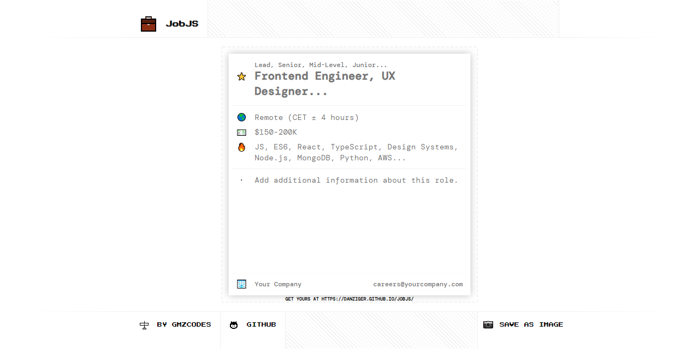

<h1 align="center">JobJS</h1>

    💼 Sharable image summaries for your open positions: Share your jobs as an image on LinkedIn and Instagram to get a visibility boost and more applicants!

    🚀 Try it out at <a href="https://danziger.github.io/jobjs">danziger.github.io/jobjs</a>!

    💩 No IE or Edge.

 

    

 

Running It (Development)
------------------------

Take a look at `package.json`, the scripts are self-explanatory.

In short, `npm start` and the project will be accessible at http://localhost:8080/jobjs/.

 

Reporting a problem
-------------------

Don't hesitate to report any issue you find in this website/project by opening a new issue in this repository, but please make sure that problem hasn't been reported before by another user as an Issue or already appears in the TODOs below.

 

TODOs
-----

- Make logo background transparent.

- Emoji picker.
  - https://github.com/joeattardi/emoji-button
  - https://www.npmjs.com/package/emoji-picker-element

- Accept icons or images indistinctive.

- Optionally keep data in localStorage.

- Validate if all additional props fit.

- Add expanded description / instructions if it's the first visit to the page.

- Move error message to a floating panel in the footer.

- 2x screenshots?

- Improve keyboard navigation.

 

Author
------

Dani Gámez Franco

LinkedIn: https://www.linkedin.com/in/danigamezfranco/

Stack Overflow: https://stackoverflow.com/users/3723993/danziger
